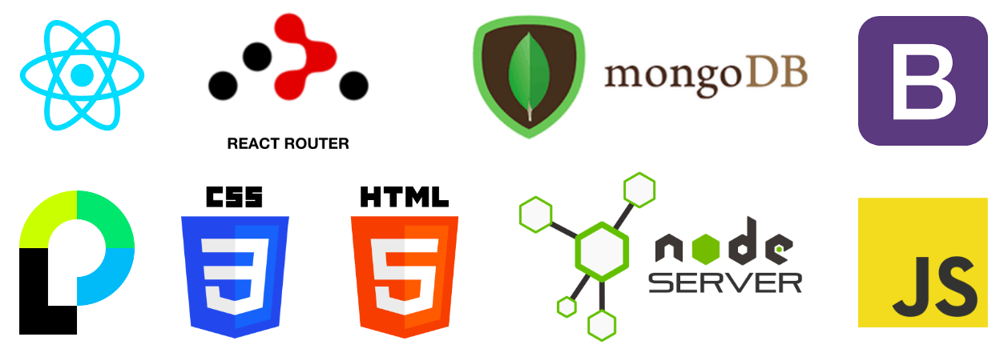
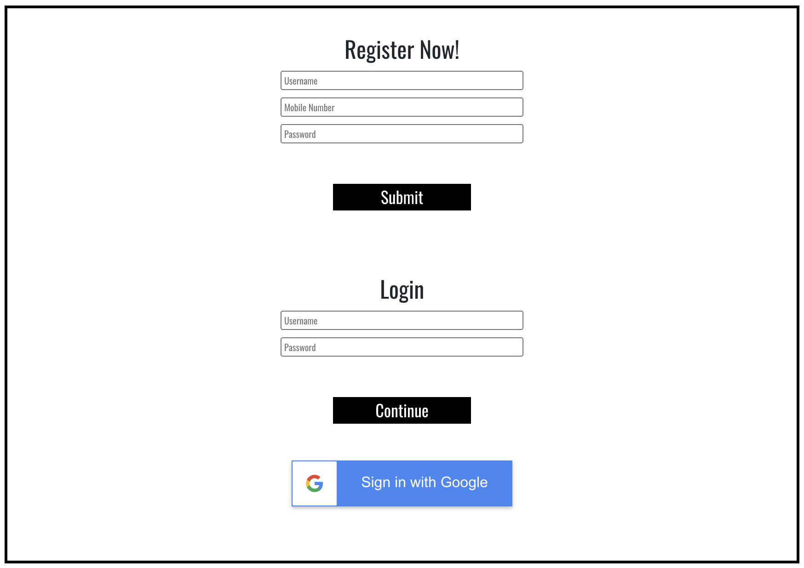
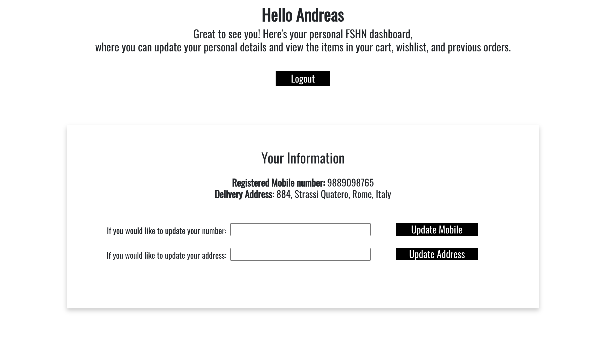
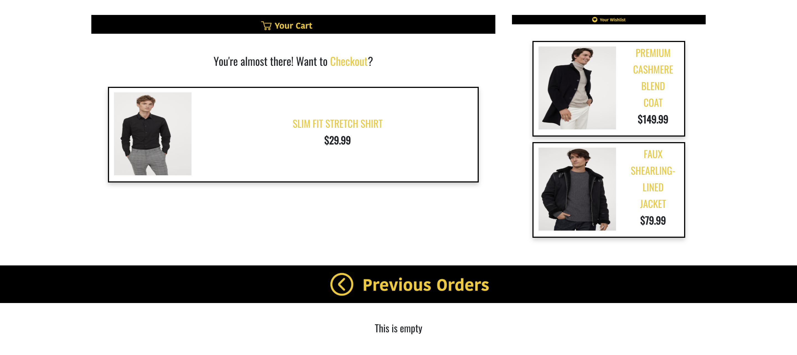
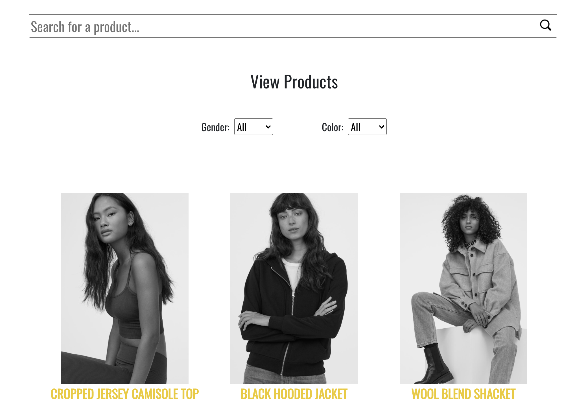

# Fashion E-Commerce Website

> Team project for Advanced Programming course. This is an e-commerce fashion website, FSHN stands for Fashionable, Sustainable, Haute & Nouveau. 

## Tech Stack

* This project is created using MERN stack applications, javascript, css, and HTML.

### Specifications



<br/>
<table>
<thead>
<tr>
<th>Area</th>
<th>Technology</th>
</tr>
</thead>
<tbody>
	<tr>
		<td>Front-End</td>
		<td>React, React-Bootstrap, CSS3</td>
	</tr>
	<tr>
		<td>Authentication</td>
		<td>Passport.js, bcrypt.js</td>
	</tr>
	<tr>
		<td>Back-End</td>
		<td>Node.js, Express, Mongoose</td>
	</tr>
	<tr>
		<td>Cookie/Database Management</td>
		<td>CookieParser, MongoDB, Mongoose</td>
	</tr>
</tbody>
</table>
<br/>

### Database

<br/>
<table>
<thead>
<tr>
<th>Defined Schemas</th>
<th>Schema fields</th>
</tr>
</thead>
<tbody>
	<tr>
		<td>Users</td>
		<td>username: String,
  		googleId: String,
  		email: String,
  		password: String,
  		address: { type: String, default: "home" },
  		mobile: Number,
  		orders: [{ type: String }],
  		cart: [{ type: String }],
  		wishlist: [{ type: String }],</td>
	</tr>
	<tr>
		<td>Products</td>
		<td>name: String,
  		description: String,
 		category: [{ type: String }],
 		color: [{type: String}],
 		gender: [{type: String}],
  		imageurl: String,
  		price: Number,
 		rating: [{ type: Number }],
  		reviews: [{ body: String, user: String, verified: String }],
  		buyers: [{ type: String }],
  		wishers: [{ type: String }],</td>
	</tr>
	
</tbody>
</table>
<br/>

## Quick Start

Open up a CLI, and execute the following commands:

```
$ git clone https://github.com/tanviroy/ap-project1.git
$ cd ap-project1

$ npm install
$ npm start

$ cd frontend
$ npm install
$ npm start
```
This should get your server to run in localhost:5000 and frontend to run in localhost:3000

## Screenshots

##### Authentication



##### Profile - User



##### Profile - Orders



##### Database - Search, Filter, Products



## Team Members
Ruthu Soham Tanvi
