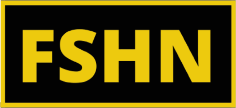

# Fashion E-Commerce Website

> Team project for Advanced Programming course. This is an e-commerce fashion website, FSHN stands for Fashionable, Sustainable, Haute & Nouveau. 

## Stack

* This project is created using MERN stack applications, javascript, css, and HTML.

## System Design

### Technology stack

 
<table>
<thead>
<tr>
<th>Area</th>
<th>Technology</th>
</tr>
</thead>
<tbody>
	<tr>
		<td>Front-End</td>
		<td>React, React Router, Bootstrap, Javascript, JSON, HTML5, CSS3</td>
	</tr>
	<tr>
		<td>Authentication Protocols</td>
		<td>Passport.js</td>
	</tr>
	<tr>
		<td>Back-End</td>
		<td>MongoDB, Node.js, Express, Mongoose</td>
	</tr>
	<tr>
		<td>Cookie/Database Management</td>
		<td>CookieParser, MongoDB, Mongoose, Express</td>
	</tr>
</tbody>
</table>
 

### Database

## Screenshots

##### Authentication

##### Profile - User

##### Profile - Orders

##### Database - Search, Filter, Products

## Team Members
Ruthu Soham Tanvi
